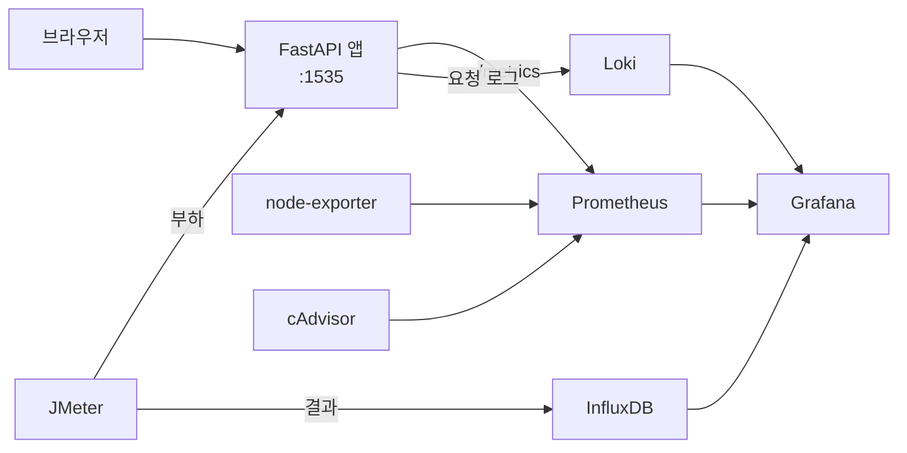

# FastAPI Todos

FastAPI로 만든 할 일·일기장 웹 서비스입니다. 기능을 하나씩 늘리면서 **테스트, 정적 분석, 메트릭·로그 모니터링, 부하 테스트, CI/CD**를 한 단계씩 얹어 운영할 수 있는 형태로 키운 **개인 프로젝트**입니다.

- 기간: 2026.03.12 ~ 2026.05.25 (약 11주), 1인 개발
- 버전: v1.0.0 → **v7.1.0** (SemVer + Conventional Commits, 태그 10개)
- 변경 이력: [CHANGELOG.md](CHANGELOG.md)


---

## 11주 동안 쌓은 것

| 버전 | 시기 | 추가한 층 |
| --- | --- | --- |
| v1.0.0 | 03.12 | FastAPI CRUD API, JSON 파일 저장, Vanilla JS 프론트엔드 |
| v3.0.0 | 03.30 | **Docker** 컨테이너화, 학교 VDI 서버 배포 |
| v4.1.0 | 04.09 | **Playwright E2E 테스트** 39개, HTML·Markdown 보고서와 실패 스크린샷 자동 생성 |
| v5.0.0 | 04.12 | **SonarQube** 도입 후 지적 사항 개선, 테스트 커버리지 100%, Pydantic v2 마이그레이션 |
| v6.0.0 | 04.30 | **Prometheus + Grafana + node-exporter**, `/metrics` 노출 |
| v6.1.0 | 05.04 | **cAdvisor** 컨테이너 메트릭, 릴리스 자동화(버전 결정·CHANGELOG·태그), 버전 변경 감지 Hook |
| v7.0.0 | 05.15 | **JMeter 부하 테스트 + InfluxDB**, **Jenkins CI/CD 8단계** |
| v7.1.0 | 05.24 | **Loki** 요청 로그 수집, 반복 할 일, 할 일↔일기 연결 |

## 구성



| 서비스 | 역할 | 포트 |
| --- | --- | --- |
| fastapi-app | 할 일·일기 API와 화면 | 1535 |
| prometheus | 메트릭 수집 (앱, node-exporter, cAdvisor) | 7070 |
| grafana | 메트릭·로그·부하 테스트 대시보드 | 3000 |
| node-exporter / cadvisor | 호스트·컨테이너 메트릭 | 7100 / 8888 |
| loki | 모든 HTTP 요청의 method·path·status·소요 시간 수집 | 3100 |
| influxdb | JMeter 결과 시계열 저장 | 8086 |
| jmeter | 부하 테스트 (`loadtest` profile, 실행 후 종료) | - |
| sonarqube | 정적 분석 | 9000 |

## CI/CD (Jenkins)

```
Checkout → Setup → Test & Coverage → Build → Push → Deploy → Build JMeter Image → Run JMeter Load Test
```

테스트와 커버리지 측정을 거친 이미지를 Docker Hub에 올리고 서버에 SSH로 배포한 뒤, 배포된 서버를 대상으로 JMeter 부하 테스트까지 이어서 실행합니다. 파이프라인은 Jenkins 서버에 구성했습니다.

## 실행

```bash
# 앱 + 모니터링 스택
docker compose up -d
```

- 앱: http://localhost:1535 · API 문서: http://localhost:1535/docs
- Grafana: http://localhost:3000

부하 테스트 대상과 결과 저장소는 JMeter 속성(`HOST`, `PORT`, `INFLUX_URL`)으로 바꿀 수 있습니다. 기본값은 CI에서 쓰는 배포 서버입니다.

## 테스트

```bash
cd fastapi-app
python -m pytest -m "not e2e" -v                      # 단위 테스트
python -m pytest -m e2e tests/e2e/ --browser chromium # E2E (Playwright)
```

- 단위 테스트 91개, E2E 테스트 60개
- v7.1.0 신규 기능(반복 할 일, 할 일↔일기 연결) 테스트 26개는 틀만 만들어 둔 상태입니다. 어설션은 직접 채우는 것을 원칙으로 두었습니다.

## API

| 메서드 | 경로 | 설명 |
| --- | --- | --- |
| GET | `/todos` | 목록 (상태·우선순위·카테고리 필터) |
| GET | `/todos/search` | 키워드 검색 |
| GET | `/todos/stats` | 완료율, 우선순위·카테고리별 통계 |
| GET | `/todos/completed-on/{date}` | 특정 날짜에 완료한 할 일 |
| POST · PUT · DELETE | `/todos`, `/todos/{id}` | 생성·수정·삭제 |
| PATCH | `/todos/{id}/toggle` | 완료 전환 (반복 할 일이면 다음 회차 생성) |
| GET · POST · PUT · DELETE | `/diary`, `/diary/{id}` | 일기 CRUD, 무드 필터 |
| GET | `/diary/{id}/todos` | 일기에 연결된 할 일 |
| GET | `/health` | 상태·버전 확인 |

## 트러블슈팅

| 문제 | 원인 | 해결 |
| --- | --- | --- |
| Jenkins에서 JMeter 컨테이너가 `exec format error`로 실패 | JMeter 이미지 베이스가 arm64 전용(맥에서 빌드)인데 Jenkins 서버는 amd64 | multi-arch 베이스 이미지(`eclipse-temurin:11-jre`)로 교체 |
| JMeter가 테스트 플랜을 읽지 못함 (`XmlPullParserException`) | JMX 파일 XML 주석 안의 `--network` | XML 표준상 주석에 `--`를 쓸 수 없어 주석 수정 |
| 부하 테스트가 엉뚱한 곳에 요청 | 가져온 JMX에 `localhost:5001`, `/users` 경로가 하드코딩 | 이 앱의 엔드포인트 5개로 다시 작성하고 호스트·포트를 외부 속성으로 분리 |
| Jenkins에서만 pytest가 `FileNotFoundError` | 템플릿 경로가 실행 위치 기준 상대경로 | 모듈 파일 기준 절대경로로 변경 |
| JMeter 보고서가 한 단계 깊은 폴더로 복사됨 | `docker cp src dst`는 대상이 있으면 그 안에 `src` 폴더를 만듦 | `src/.` 형식으로 복사 |
| VDI 서버에서 컨테이너 빌드 실패 | VDI 환경의 runc 오류 | 다른 환경에서 빌드해 Docker Hub에 올린 이미지를 받아 쓰도록 전환 |
